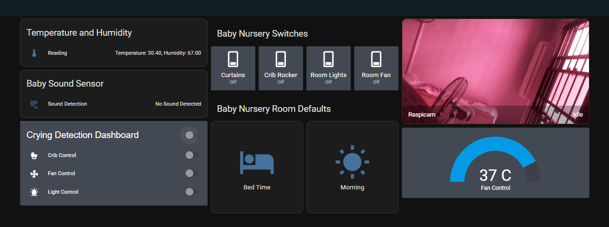
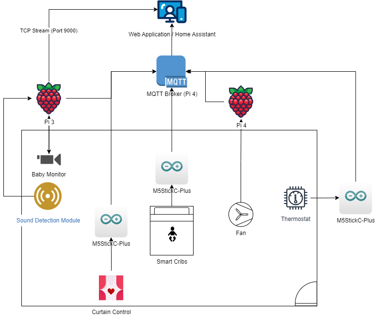

# T22 Smart Baby Nursery Project
This **CSC2106** project will be a proof-of-concept for our IoT module, where we will design a smart baby nursery. Leveraging on **Smart Home** technology to build an all-in-one **Smart Baby Nursery**, using Microcontrollers, Sensors and Home Assistant OS to bring everything together. Problem Statement: 

## Project Equipment
1. Raspberry Pi4 (MQTT Broker)
2. Raspberry Pi Pico W
3. M5 StickC-Plus
4. Temperature + Humidity Sensor (MQTT Topic: `temperature-humidity`)
5. Servos Motor (SG995/SG90) (MQTT Topics: `motor-movement` and `curtain-movement`)
6. DC Motor
7. Raspberry Pi-Cam 2
8. LED-Lights (MQTT Topic: `led-control`)
9. Sound Sensor (KY037 Sound Detection Module) / ~~USB Microphone~~
10. Raspberry Pi3 

## Software/Protocols/Technology Used
1. Python
2. Home Assistant
3. MQTT
4. Arduino / C

## Project Logs
1. We will abandon the usage of the Pico W, as we had some issues setting up the MQTT protocol on the Pico W. We will be using the M5 StickC-Plus instead.
2. Currently unable to connect the Pi-Cam to the Raspberry Pi4, as the Pi-Cam is incompatible with the Raspberry Pi4. We will be using a Pi3 instead.
3. Due to the power consumption of the SG995 Servo Motor, we will use the SG90 Micro Servo Motor Module to allow the M5StickC Plus to control the movement via PWM.
4. For the Pi Camera, we will utilise the in-built customisation within Home Assistant to stream the video feed to Home Assistant for the Homeowner to view the baby.
5. ~~To limit the MQTT traffic in attempts to reduce the latency, we will update the DHT11 Temperature and Humidity Sensors to update on Command from the Home Assistant~~
6. Added the scripts to autorun on startup (For Pi-Cam and Sound Detection Sensors)
7. Added the automation scripts to the Home Assistant OS
8. Added user customisation for Automation values into the Home Assistant Dashboard

    * Customise threshold to automatically turn on or off the fan
    * Customise response to baby crying. *Fan*, *Crib Rocker* and *LED*
9. Implement security measures on the Raspberry Pi 3 *(With the Pi Cam)*. To ensure that only the Home Assistant can communicate with the Camera, and secure the Baby Monitor Footage
    * `sudo ufw allow ssh`
    * `sudo ufw allow from 192.168.96.194 to any port 9000 proto tcp`
    * `sudo ufw allow from 192.168.96.194 to any port 1883 proto tcp`
    * `sudo ufw enable`
10. Implementation of Performance Testing with BLE

## Project Setup

1. Insert code into respective microcontrollers
   * Image Home Assistant OS Image into SD Card
   * Insert SD into Raspberry Pi 4 and setup Home Assistant OS on a Raspberry Pi 4
   * Connect it to your home network to access it at (**homeassistant.local:8123**)
   * Insert [Fan](Fan/fan.py) code into Raspberry Pi 4
   * Setup raspicam.service into Raspberry Pi 3, connect camera module into Raspberry Pi 3
   * Insert [LED](led/led.ino) code into M5StickC Plus Microcontroller
   * Insert [Crib Rocker](sg90-motor-crib/sg90-motor-crib.ino) code into a M5StickC Plus Microcontroller
   * Insert [Curtain Control](sg90-motor-curtain/sg90-motor-curtain.ino) code into a M5StickC Plus Microcontroller
   * Insert [Crying Detection](sound-detection/sound-detection.py) code into Raspberry Pi 3
   * Setup hello.service into the Pi 3 as well to ensure the Crying Detection program executes on startup
   * Insert [Temperature and Humdity](temp-sensor/temp-sensor.ino) code into a M5StickC Plus Microcontroller
2. Install MQTT Broker Add-On in the Home Assistant Server (**Keep Track of IP Address and update the code accordingly if needed**)
3. Insert automation files in the directory
4. Update the configuration file using the [sample configuration.yaml file](configuration-files/configuration.yaml)
5. Restart the Home Assistant Server and the MQTT connections should be established (Sensor and Switches will appear as entities)
6. Add the entities to the Dashboard
7. Load the added automation in the settings and add them to the Dashboard

## Protocol Logs
1. First, we landed on MQTT because we did not need to use long-range protocols, thus ruling out LoRa.
2. Second, we decided against subscription-based protocols like Z-Wave and Zigbee, reducing overhead costs and allowing us to use IoT devices that aren't compatible with these protocols.
3. We will not use the external Broker. Instead, we will utilise the internal Home Assistant Add-On MQTT Broker to save on the number of Raspberry Pi used for this project.
4. For the performance testing, we will test a portion of our solution environment using BLE, from the tests we will obtain the latency and calculate the estimated throughput of the evironment.
5. Reason for testing a small portion:
   * Only a portion of the solution can utilise BLE.
   * Raspberry Pi Cam is not suitable with BLE.
   * Not enough hardware microcontrollers to conduct full testing of all BLE-capable microcontrollers.

## Pinouts
#### Blinds Control
1. Servo Motor 5V to M5StickC Plus 5V Output
2. Servo Motor GND to M5StickC Plus GND
3. Servo Motor PWM to M5StickC Plus GPIO26

#### Crib Control
1. Servo Motor 5V to M5StickC Plus 5V Output
2. Servo Motor GND) to M5StickC Plus GND
3. Servo Motor PWM to M5StickC Plus GPIO26

#### LED Control
1. LED Longer Wire to G26
2. LED Shorter Wire to GND

#### DHT11 Sensor
1. DHT11 VCC PIN to M5StickC Plus 3V3 PIN
2. DHT11 Data PIN to M5StickC Plus GPIO26 PIN
3. DHT11 GND PIN to M5StickC Plus GND PIN

#### KY037 - Sound Detection Module
1. KY037 +ve pin to Raspberry Pi 3 PIN 4 - 5V Output
2. KY037 GND to Raspberry Pi 3 PIN 6 - GND
3. KY037 Digital Pin (D0) to Raspberry Pi 3 PIN 8 - GPIO14

#### 5V DC Motor Fan
1. 5V DC Motor -ve & +ve to L298N Motor Driver Right Output (Either Way Will Do)
2. Battery +ve and -ve to L298N Motor Driver Power Input
3. L298N Motor Driver -ve to Raspberry Pi 4 PIN 39 - GND
4. L298N Motor Driver Directional Pins to Raspberry Pi 4 PIN 38 & 40 - GPIO20 & GPIO21

## References and Sources:
1. https://www.instructables.com/ESP32-Based-M5Stack-M5stick-C-Weather-Monitor-With/
2. https://randomnerdtutorials.com/how-to-install-mosquitto-broker-on-raspberry-pi/
3. https://gist.github.com/hkaji/8beef2790886b383e82e02585f9a5071
4. https://www.home-assistant.io/integrations/stream/
5. https://einar.slaskete.net/2018/08/16/using-a-raspberry-pi-as-a-surveillance-camera-in-home-assistant/
6. https://www.instructables.com/Sound-Sensor-Raspberry-Pi/
7. https://gist.github.com/emxsys/a507f3cad928e66f6410e7ac28e2990f

